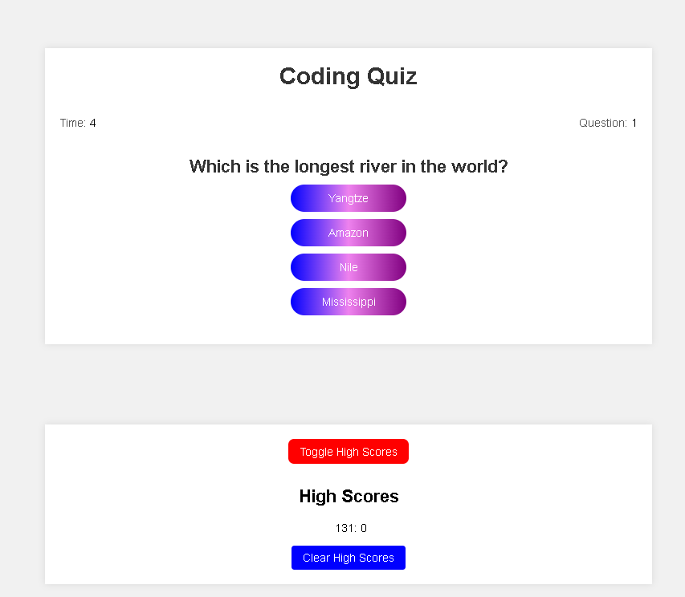
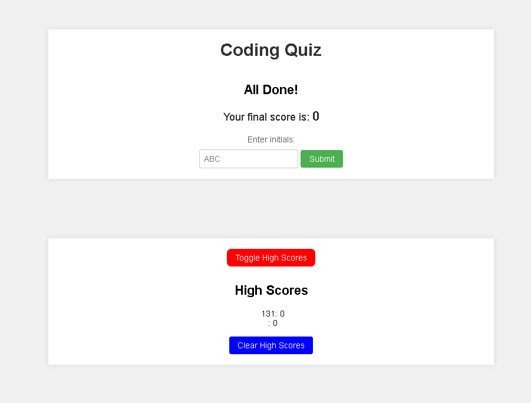

# Coding Quiz

A simple quiz app that tests your knowledge in various subjects. Answer the questions correctly within the time limit to earn a high score. Compete with others and see if you can make it to the top of the leaderboard!

## Live Demo

Try the live demo: [Coding Quiz](https://hyperlitz.github.io/lito_quizchallenge)

## Repository

Check out the code and contribute: [Coding Quiz Repository](https://github.com/hyperlitz/lito_quizchallenge)

## Screenshots

*Quiz Start*

*Quiz End*

## Features

- Multiple-choice questions with randomized options
- Countdown timer for each question
- Score tracking and high score leaderboard
- User initials input for high score submission
- Responsive layout for mobile and desktop devices

Developed by LITO BANANO